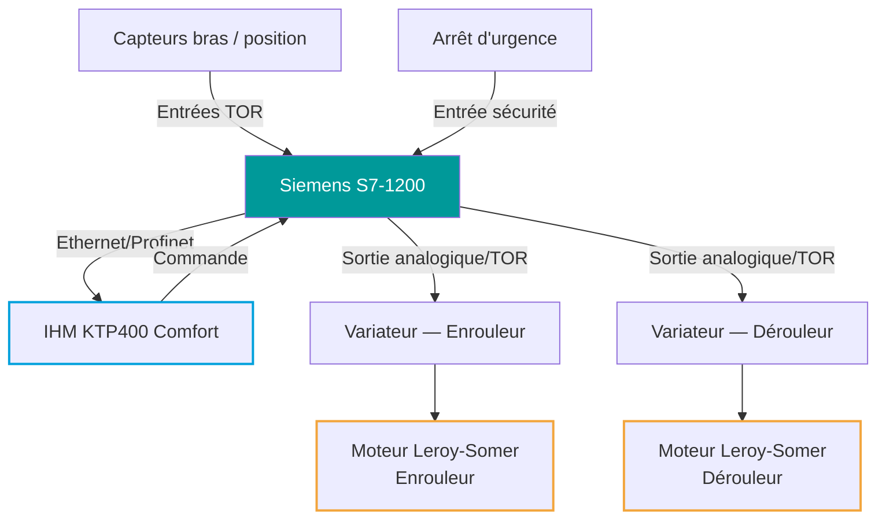
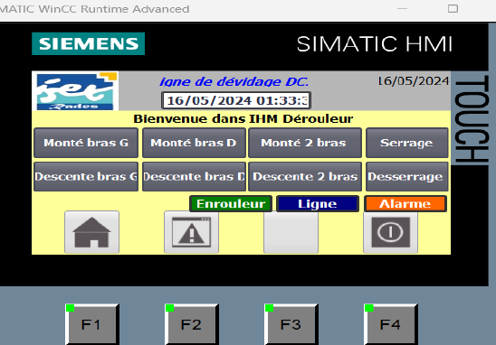
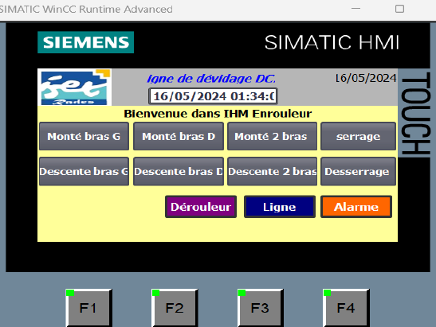
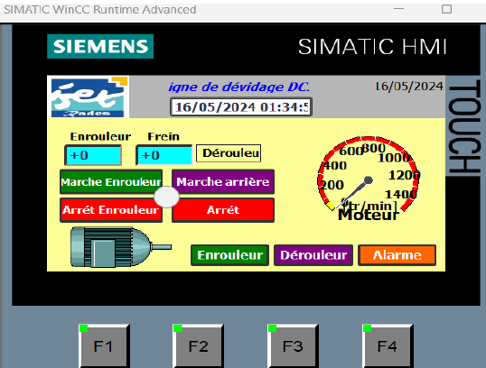
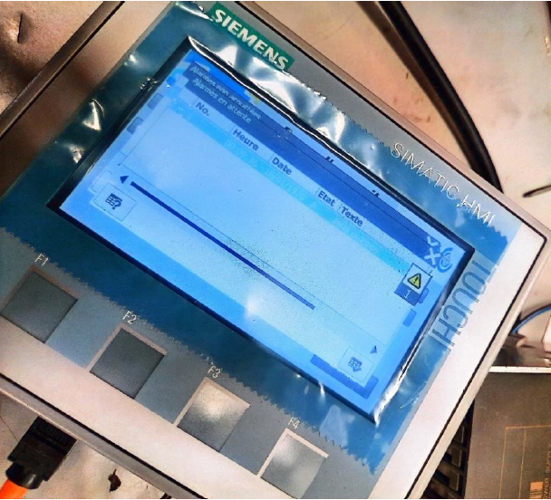
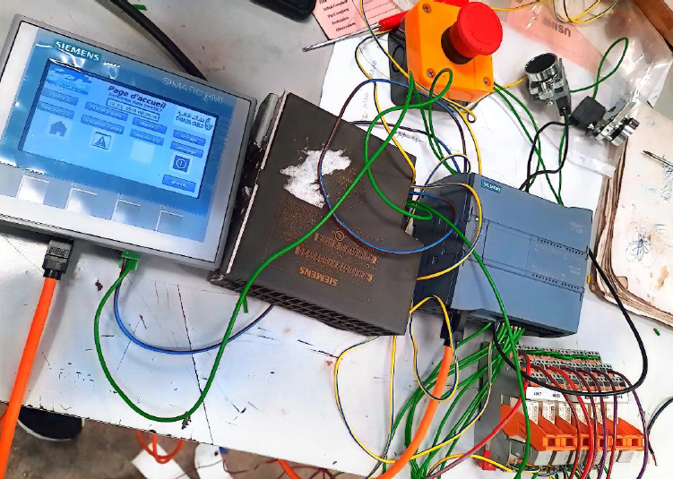
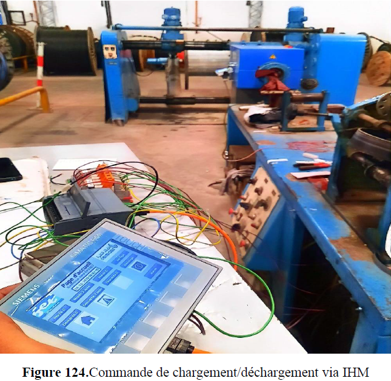

# Automatisation d'une Ligne de Dévidage de Câble

### Commande, synchronisation et supervision via Siemens S7-1200 / TIA Portal

`Automatisme Industriel` · `Programmation PLC` · `Synchronisation Moteurs` · `SCADA / IHM`

---

## 📋 Vue d'ensemble

Automatisation complète d'une ligne de dévidage de câble en environnement industriel, réalisée sur automate Siemens S7-1200 avec supervision via IHM tactile. Le système pilote et synchronise les moteurs Leroy-Somer de l'enrouleur et du dérouleur, régule leur vitesse via variateurs, et centralise la commande, l'affichage des paramètres et la gestion des alarmes sur trois écrans IHM dédiés.

## ⚙️ Contributions clés

- 🖥️ Programmation Siemens S7-1200 (TIA Portal V16) pour la commande et la synchronisation des moteurs
- ⚙️ Régulation de vitesse des moteurs Leroy-Somer via variateur de vitesse
- 📟 Développement de trois interfaces IHM dédiées : Dérouleur, Enrouleur, Ligne
- 🚨 Gestion centralisée des alarmes et défauts sur écran KTP400 Comfort
- 🔧 Validation et mise en service directement sur ligne industrielle (Chakira Câble)

## 🏗️ Architecture du système

## 🖥️ Interfaces IHM

Le système est piloté via trois écrans IHM dédiés, accessibles depuis la page d'accueil.

### IHM Dérouleur

  
   <em>Commande des bras (montée/descente gauche, droit, deux bras) et du serrage/desserrage</em>

### IHM Enrouleur

  
   <em>Commandes miroir de l'enrouleur, avec accès direct au module Dérouleur et aux alarmes</em>

### IHM Ligne — pilotage moteur et vitesse

  
   <em>Affichage de la vitesse (tr/min), marche avant/arrière, arrêt, et navigation entre modules</em>

### Gestion des alarmes

  
   <em>Journal des alarmes actives et historiques (numéro, heure, date, état, texte)</em>

## 🔧 Matériel

| Composant | Rôle |
|---|---|
| Siemens S7-1200 | Automate (PLC) — logique de commande |
| IHM KTP400 Comfort | Supervision tactile et gestion des alarmes |
| Moteurs Leroy-Somer ×2 | Actionneurs enrouleur / dérouleur |
| Variateurs de vitesse | Régulation de la vitesse moteur |
| Arrêt d'urgence | Sécurité opérateur |
| TIA Portal V16 | Environnement de développement et configuration |

## 🎥 Mise en œuvre sur site

### Configuration matérielle S7-1200 + IHM

  
   <em>Câblage complet de l'automate, de l'IHM et des entrées/sorties avant intégration sur ligne</em>

### Commande de chargement/déchargement en atelier

  
   <em>Pilotage direct de la ligne de dévidage depuis l'IHM, en conditions industrielles réelles</em>

## 🚀 Mise en service

1. Configurer le projet dans TIA Portal V16 (matériel : CPU S7-1200 + IHM KTP400)
2. Charger le programme ladder dans l'automate via Ethernet
3. Charger le projet IHM (WinCC Runtime Advanced) sur l'écran tactile
4. Vérifier le câblage des variateurs et des capteurs de position des bras
5. Tester chaque commande individuellement (montée/descente bras, serrage) avant synchronisation complète
6. Valider la régulation de vitesse et la gestion des alarmes en conditions réelles

## 🎥 Demo

[Watch demo video](https://www.youtube.com/watch?v=85S1mk2_ycc)

## 🔭 Pistes d'amélioration

- **Journalisation des alarmes** : exporter l'historique des défauts vers un fichier ou une base de données pour analyse de fiabilité
- **Supervision à distance** : ajouter une passerelle (OPC UA ou API web) pour un suivi de la ligne hors atelier
- **Asservissement de vitesse en boucle fermée** : intégrer un retour codeur pour une régulation plus précise
- **Diagnostic prédictif** : exploiter les données de fonctionnement moteur pour anticiper la maintenance

## 🛠 Tech Stack

`Siemens S7-1200` · `TIA Portal V16` · `Ladder Logic` · `KTP400 Comfort` · `WinCC Runtime Advanced` · `Variateurs de vitesse` · `Automatisme industriel`

## 📄 License

MIT
